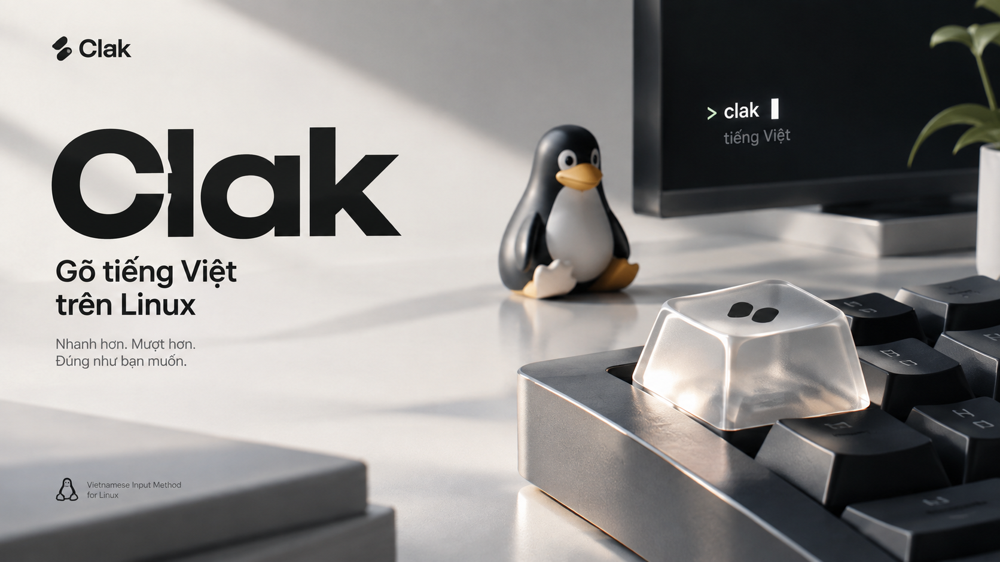
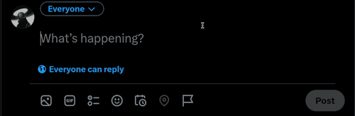
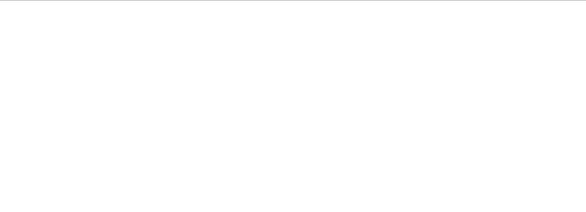
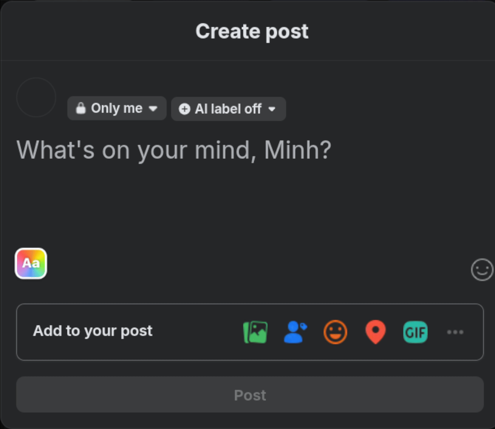
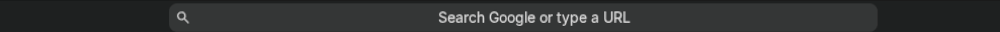
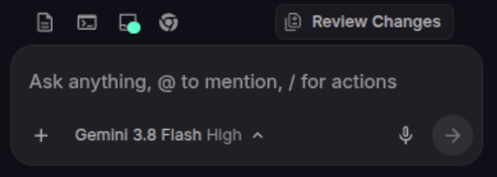
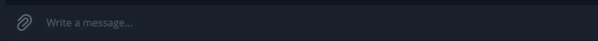
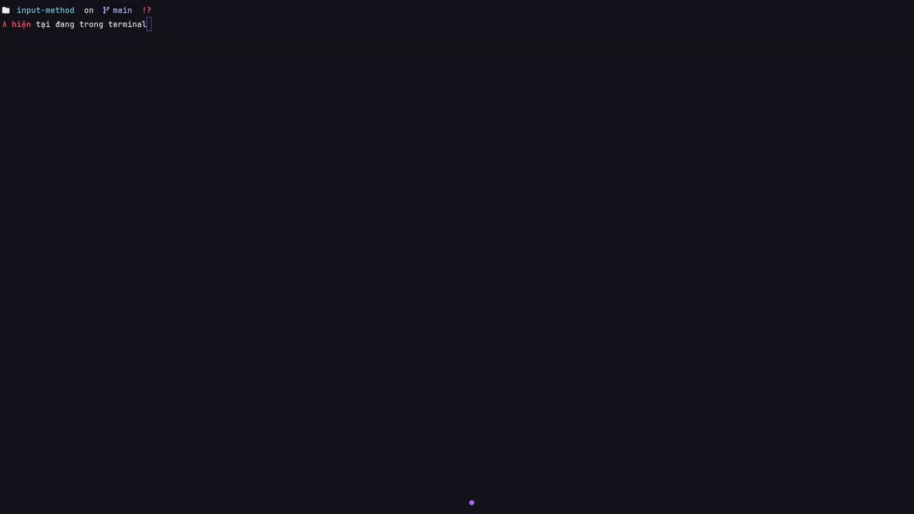
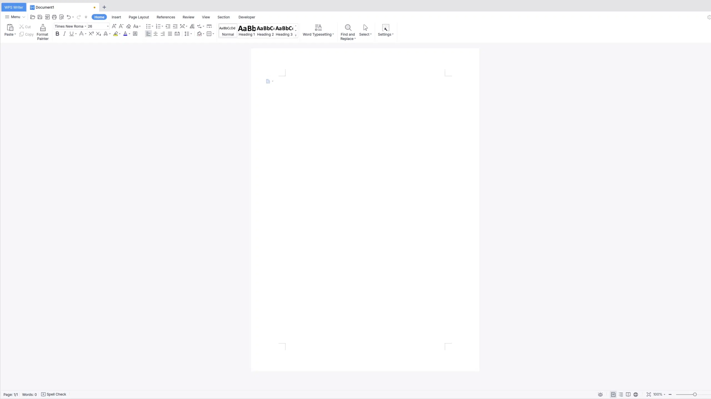

<p align="center">
  
</p>

<!-- <h1 align="center">Clak</h1> -->

<!-- <p align="center">
  <em>Bộ gõ tiếng Việt ổn định cao dành cho Linux</em>
</p> -->

## Cài đặt

### Ubuntu / Debian:

Cài nhanh qua script tự động (tự nhận diện và cấu hình Fcitx5):

```bash
curl -fsSL https://raw.githubusercontent.com/versenilvis/clak/main/scripts/install.sh | bash
```

Hoặc tải gói `.deb` từ [Releases](https://github.com/versenilvis/clak/releases) rồi cài đặt:

```bash
sudo apt install ./clak_*_amd64.deb
```

### Arch Linux (AUR):

```bash
# bản prebuilt binary dựng sẵn (khuyên dùng)
yay -S clak-bin
# hoặc paru -S clak-bin

# hoặc tự build từ source
yay -S clak
```

### Nix Flake:

```bash
nix profile install github:versenilvis/clak
```

> [!NOTE]
> Clak có sẵn bàn phím tiếng Anh, bạn không cần thêm bất cứ bàn phím nào khác ngoài Clak cả  
> Sử dụng tổ hợp phím `Ctrl + Shift` để chuyển đổi ngôn ngữ  
> Clak mang lại trải nghiệm gõ giống hệt như trên Windows

## Các điểm chính

- Clak giúp bạn gõ trên Twitter/X mượt mà btw



- Clak giúp bạn gõ trên Google Docs mượt mà btw



- Clak giúp bạn gõ trên Facebook mượt mà btw



- Clak giúp bạn gõ trên thanh địa chỉ URL mượt mà btw



- Clak giúp bạn gõ trên các app Electron mượt mà btw



- Clak giúp bạn gõ trên Telegram Desktop/Web mượt mà btw



- Clak có thể detect được các cli tool như Neovim và biết chính xác đang ở mode nào để giúp trải nghiệm muợt mà hơn btw



- Clak giúp bạn gõ trên WPS Office/LibreOffice mượt mà btw



## Gỡ cài đặt

Clak Settings > Giới thiệu > Gỡ cài đặt


## Feedback

- [Email](mailto:versedev.store@proton.me)
- [Twitter](https://twitter.com/versenilvis)
- [GitHub issues](https://github.com/versenilvis/clak/issues/new)

## Giấy phép

Bộ gõ này được cấp phép bởi giấy phép [0BSD License](LICENSE). Điều đó có nghĩa rằng bạn có thể sửa, xóa, thêm hay làm bất cứ thứ gì bạn muốn với nó.
